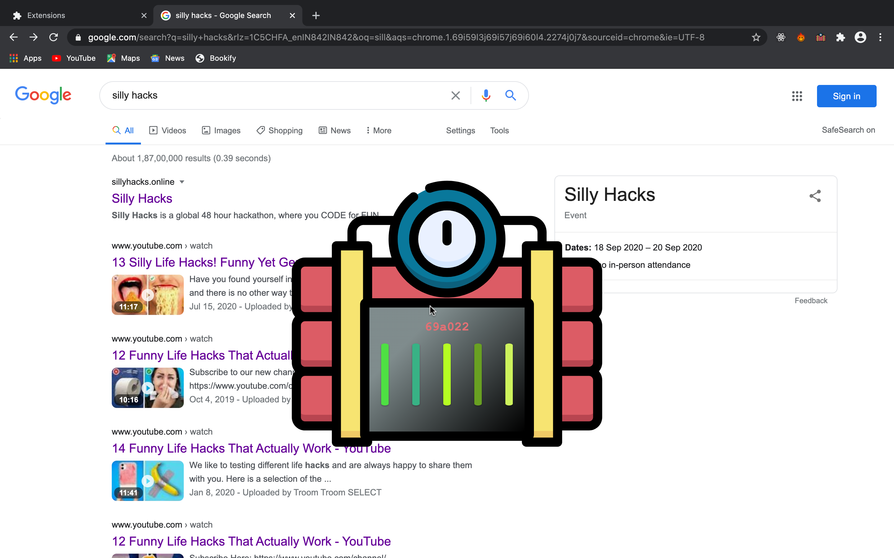

#
# Not a Bomb™

### Online class too stressful? 😰
### Is your friend making you see his shitty gameplay? 😒
### Are you just evil? 😈
### Your siblings using your laptop?👨🏻‍💻

#### Have you ever found yourself getting distracted for hours browsing the web? Do you get tired and sluggish while studying for exams? 🥱

   </h2>

## 💥💥💥 Now's the time to Blast it up 💥💥💥

## ☑️Features
<pre>
* Burts off the links in your browser better than Elon's Rockets
* Set off Timer
* New puzzles every week
</pre>

### Go ahead clone this repository and have some fun 😼

## Installation guide 👉 
- Download the github repo and unzip
- Open chrome
- Open manage extensions
- Click on Load unpacked button
- Upload the unzipped folder.
- Search anything on the browser and let the magic happen.

## Demo
Demo 👉 <a href="https://www.youtube.com/watch?v=9Sj_JRzsuq0&feature=emb_logo">link</a>

#

